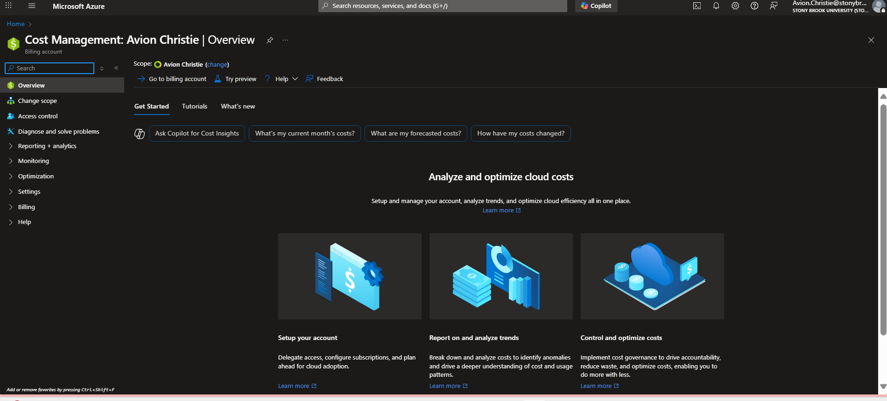
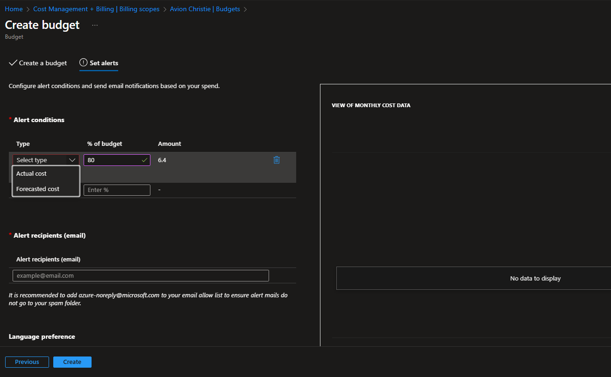
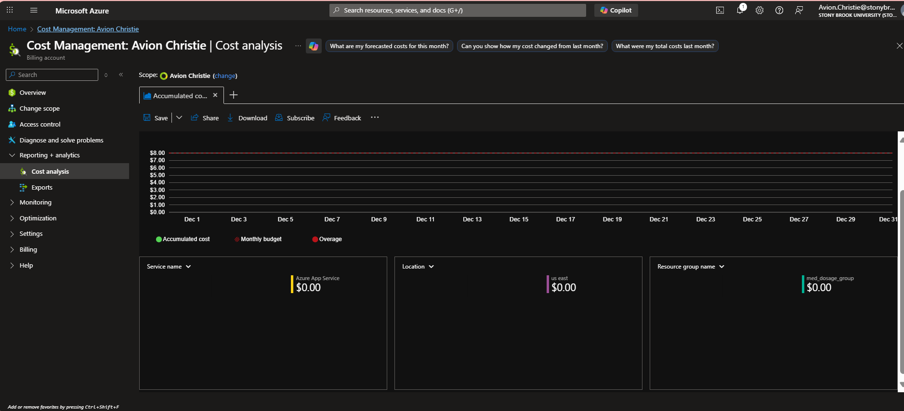
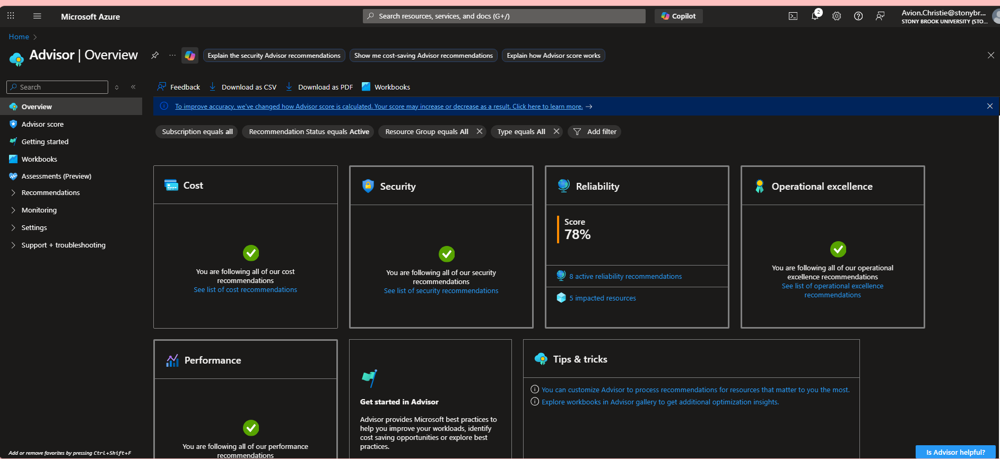
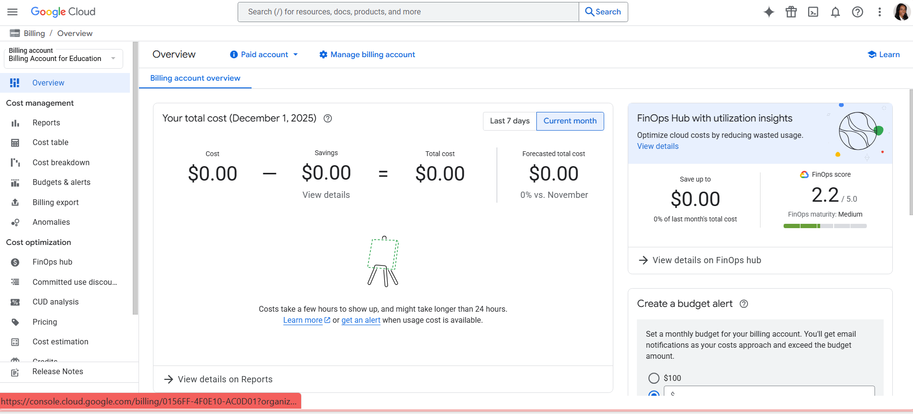
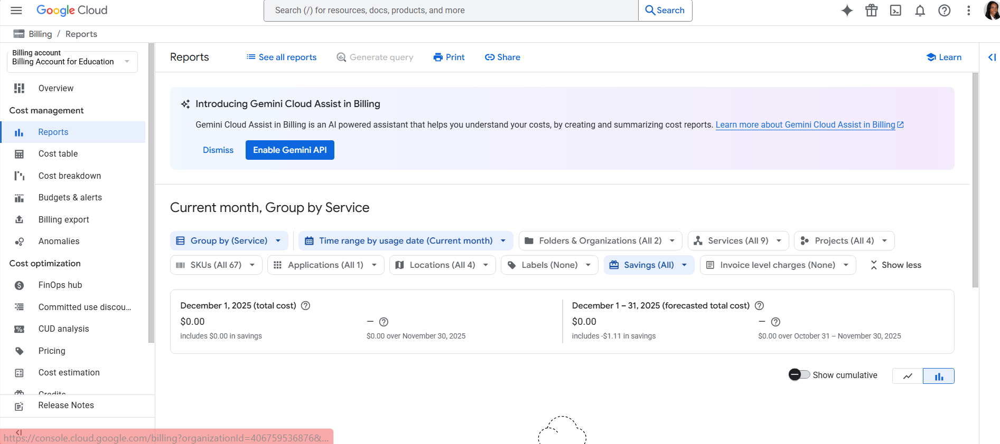
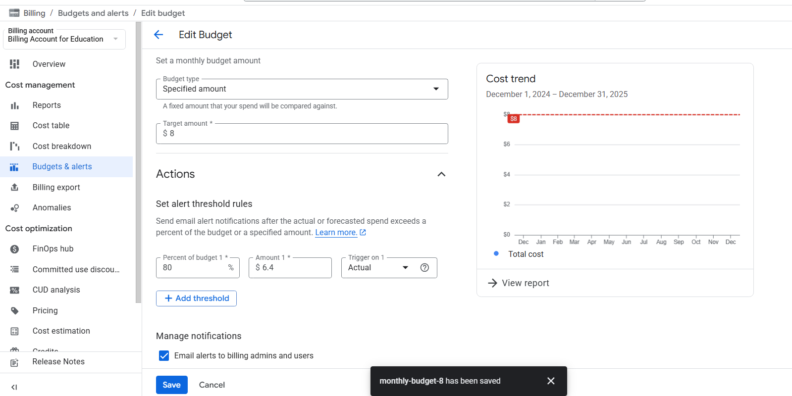
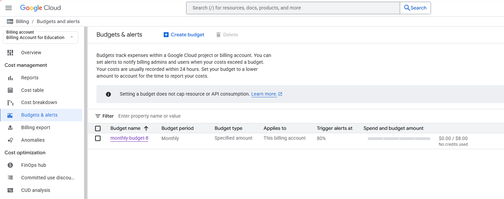
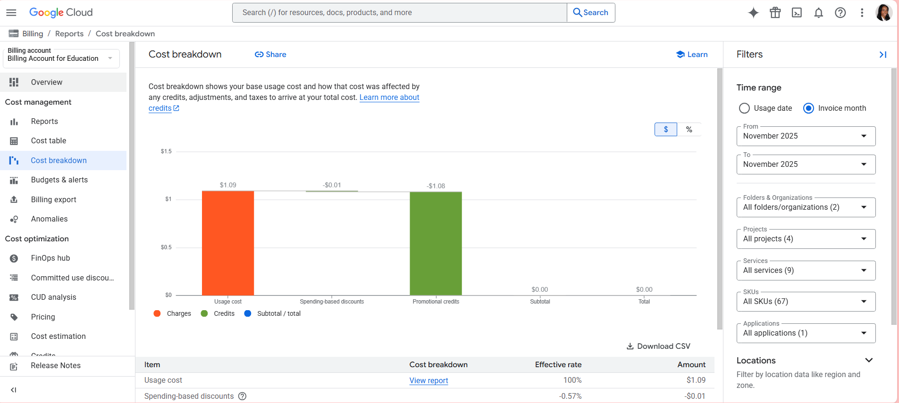
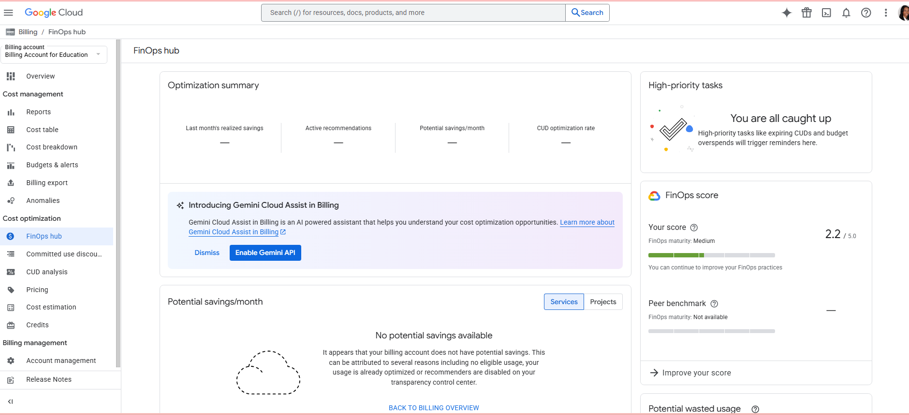

# HHA504_assignment_cloudcosts
# Cloud Foundations – Cost Management Assignment  

This assignment compares cost-management tools in Microsoft Azure and Google Cloud Platform (GCP). I created monthly budgets, made alert thresholds, reviewed cost dashboards, and learned abot forecasting and optimization features on both platforms.

---

## Part 1 — Microsoft Azure

### 1. Billing Overview  

---

### 2. Budget Creation  
$8 monthly budget with an 80% alert threshold.  

---

### 3. Cost Analysis / Forecasting  
Azure Cost Analysis showing accumulated cost and budget projection.  

---

### 4. Azure Advisor — Cost Section  
No cost recommendations appeared, which is expected for minimal usage.  

---

## Part 2 — Google Cloud Platform (GCP)

### 1. Billing Overview  

---

### 2. Reports Dashboard  

---

### 3. Budget Creation  
Monthly $8 budget created under Budgets & Alerts.  

---

### 4. Budget Summary (80% Threshold)  

---

### 5. Cost Breakdown  
Shows usage, credits, and total cost calculations.  

---

### 6. FinOps Hub / Recommendations  
No active recommendations were available due to low usage.  

---

## Conclusion
Both Azure and GCP gives strong cost management features. Azure gives detailed forecasting and Advisor insights, while GCP gives a clear billing interface with reports and FinOps help. Although neither platform generated recommendations due to little resource usage, this assignment showed how budgets, alerts, and cost dashboards help manage spending responsibly in cloud environments.
